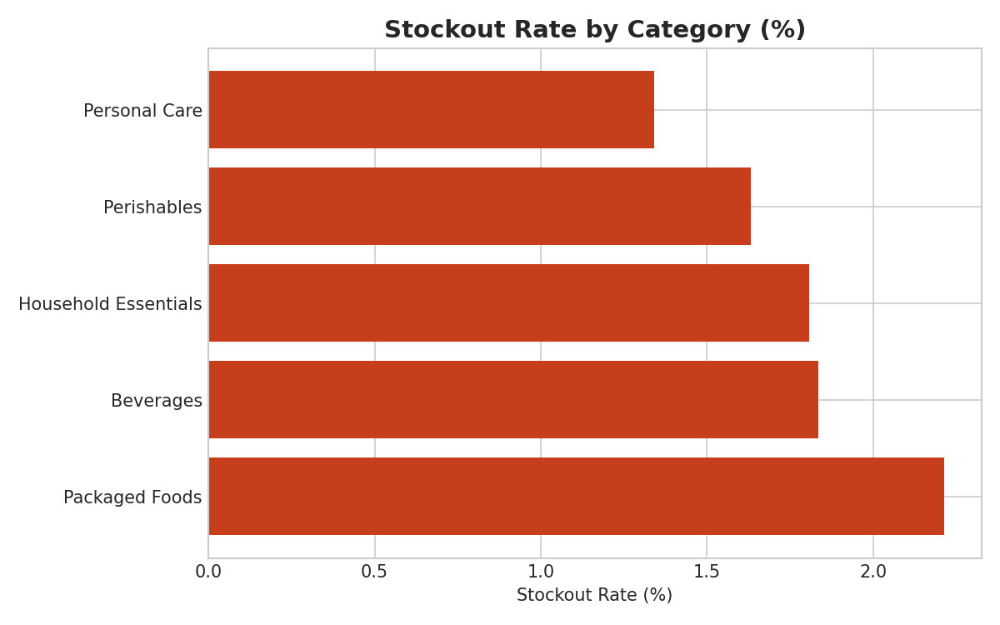
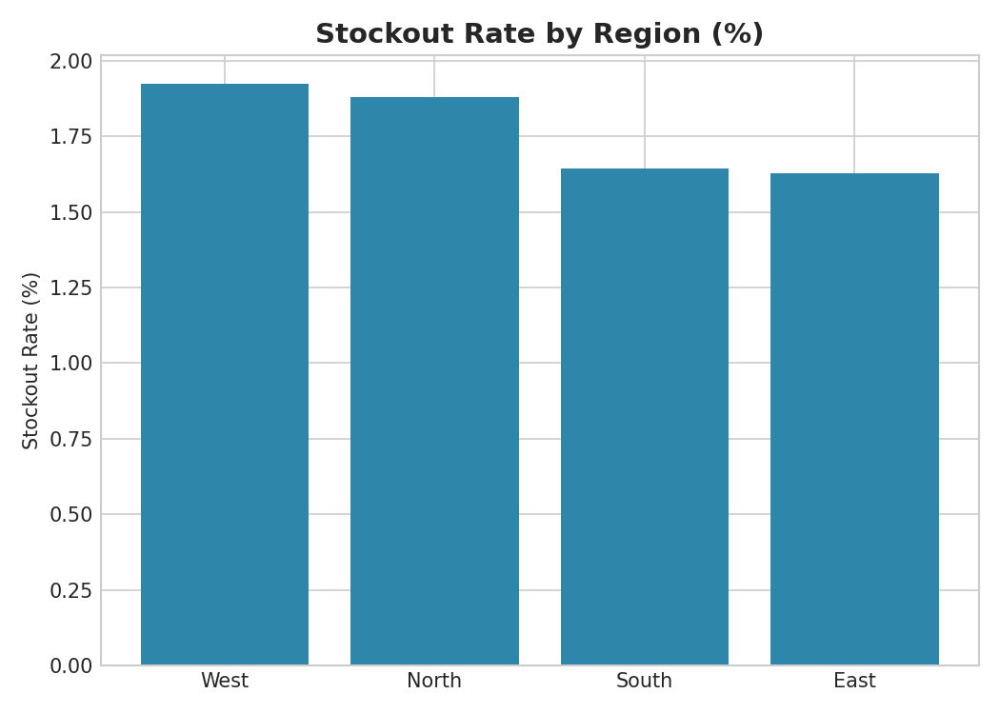
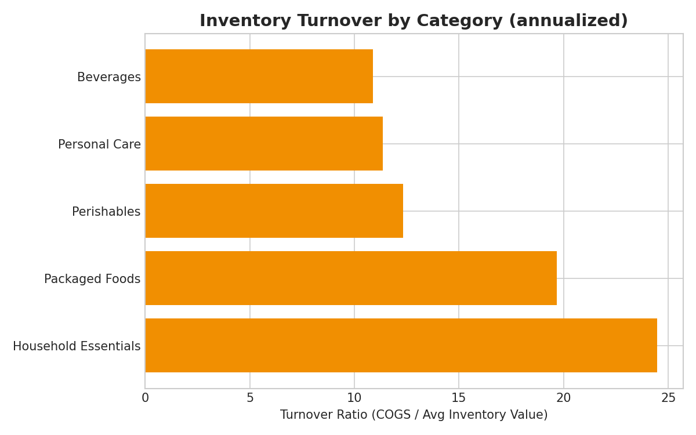
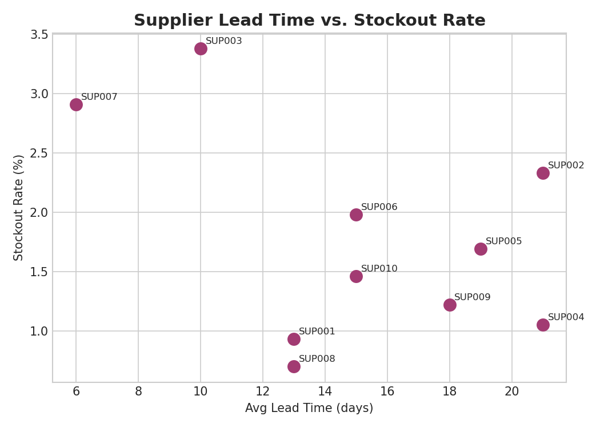
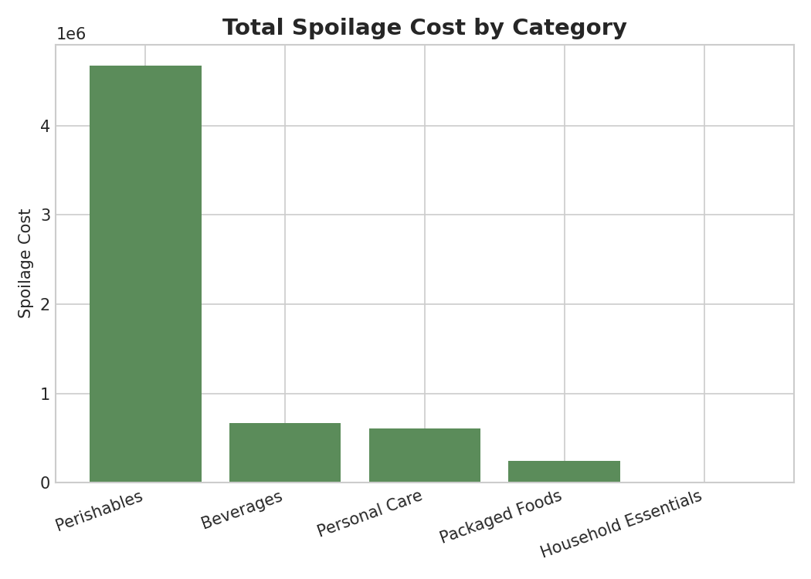
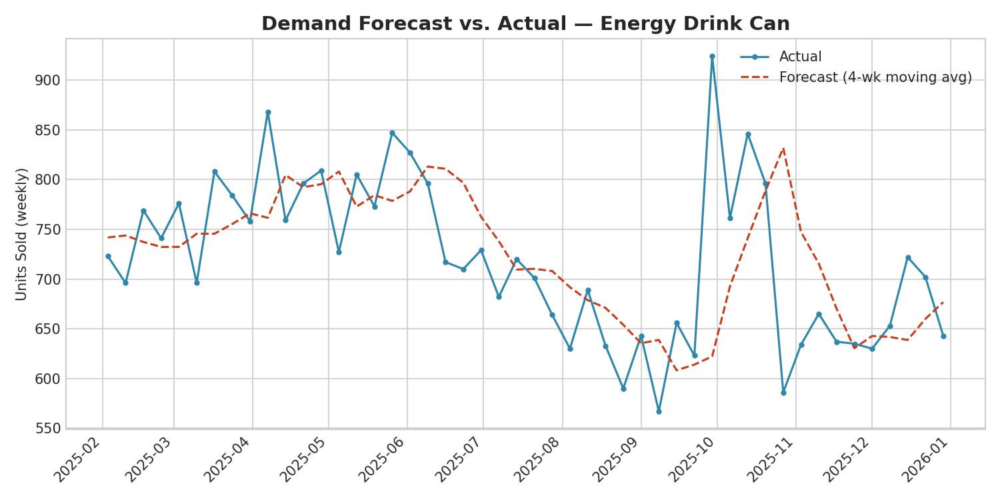

# Retail Inventory & Supply Chain Analytics (SQL + Python + Power BI)

An end-to-end supply chain analytics project for a multi-region retail
chain: why are stores running out of stock, which suppliers are actually
causing it, how much is spoilage costing the business, and can a simple
forecast improve reordering? Built using **SQL**, **Python (pandas)**, and
designed to plug directly into **Power BI** for an interactive dashboard.

## Problem Statement

The chain has stockouts eating into sales and spoilage eating into margin,
but no clear view of *why* — is it demand spikes, slow suppliers, unreliable
suppliers, or badly-set reorder points? This project traces stockouts and
spoilage back to their actual drivers across 16 stores, 30 products, and
10 suppliers over a full year of weekly inventory data.

## Tech Stack

- **Python**: pandas, numpy, matplotlib — cleaning, KPI calculation, root
  cause analysis, and a simple demand forecast
- **SQL**: SQL (queries portable to PostgreSQL/MySQL with minor tweaks)
- **Power BI**: a ready-to-import flat dataset + full DAX measures + a
  page-by-page build guide (`powerbi/POWER_BI_GUIDE.md`) — not a `.pbix`
  file, since that's a binary format unsuited to a Git repo, but everything
  needed to build the dashboard yourself in ~20 minutes
- **Data**: synthetic weekly inventory ledger (52 weeks, 16 stores, 30
  products across 5 categories, 10 suppliers) simulating realistic
  reorder-point behavior, supplier lead times, delivery delays, and
  perishable spoilage — intentionally includes missing values, inconsistent
  text, and duplicates for cleaning practice

## Project Structure

```
retail-supply-chain-analytics/
├── data/
│   ├── inventory_ledger.csv         # raw weekly stock ledger (with data quality issues)
│   ├── inventory_ledger_clean.csv   # cleaned data (output of analysis.py)
│   ├── stores.csv                    # store master data
│   ├── products.csv                  # product catalog
│   ├── suppliers.csv                 # supplier master data
│   ├── powerbi_dataset.csv          # flat, joined table ready for Power BI import
│   └── summary_metrics.csv          # key headline metrics
├── sql/
│   └── schema_and_queries.sql       # table schema + 10 business-question queries
├── images/                          # generated charts
├── powerbi/
│   └── POWER_BI_GUIDE.md            # step-by-step dashboard build guide + DAX measures
├── analysis.py                      # cleaning + KPI + root cause + forecast analysis
├── SUPPLY_CHAIN_RECOMMENDATIONS.md  # actionable supplier/inventory/spoilage strategy
└── README.md
```

## How to Run

```bash
pip install pandas numpy matplotlib
python analysis.py
```

This cleans the data, prints KPI and root-cause analysis to the console,
regenerates all charts in `images/`, and exports the Power BI-ready dataset.

To run the SQL queries, load the cleaned CSVs into SQL:
```bash
SQL3 data/supply_chain.db
.mode csv
.import data/inventory_ledger_clean.csv inventory_ledger
.import data/stores.csv stores
.import data/products.csv products
.import data/suppliers.csv suppliers
.read sql/schema_and_queries.sql
```

To build the dashboard, follow `powerbi/POWER_BI_GUIDE.md`.

## Data Cleaning Steps

- Removed exact duplicate rows
- Standardized inconsistent category naming (`packaged foods` / ` Packaged Foods ` → `Packaged Foods`)
- Filled missing `units_received` values with 0 (no delivery recorded that week)

## Key Findings

- **Overall fill rate: 98.2%** (1.8% stockout rate) — solid on average, but
  masks real gaps by category and supplier
- **Supplier reliability drives stockouts more than lead time does**: lead
  time actually correlates *negatively* with stockout rate (-0.45) because
  reorder points already compensate for slow suppliers — but reliability
  correlates as expected (-0.44), meaning **unreliable suppliers, not slow
  ones, are the real risk**
- **Packaged Foods has the highest stockout rate (2.2%)** despite not being
  perishable — a reorder-point sizing issue more than a supply problem
- **Spoilage is heavily concentrated in Perishables**, by far the largest
  share of total spoilage cost — a targeted fix (smaller, more frequent
  orders) rather than a catalog-wide policy change
- **A simple 4-week moving-average forecast hit ~7% MAPE** on the
  highest-volume product — accurate enough to meaningfully improve reorder
  timing without needing a complex model

### Stockout Rate by Category


### Stockout Rate by Region


### Inventory Turnover by Category


### Supplier Lead Time vs. Stockout Rate


### Spoilage Cost by Category


## Demand Forecast vs. Actual

A simple 4-week moving-average forecast was tested against actual weekly
demand for the highest-volume product in the catalog:



**Interpretation:** even this simple approach tracks actual demand closely
(~7% MAPE), suggesting a low-maintenance forecasting layer could meaningfully
tighten reorder timing chain-wide, especially ahead of seasonal demand spikes.

## Supply Chain Recommendations

See [`SUPPLY_CHAIN_RECOMMENDATIONS.md`](SUPPLY_CHAIN_RECOMMENDATIONS.md) for
the full set of supplier, category, and regional recommendations — including
an honest note on why the lead-time finding looks backwards at first glance.

## Power BI Dashboard

See [`powerbi/POWER_BI_GUIDE.md`](powerbi/POWER_BI_GUIDE.md) for a full
walkthrough: DAX measures, page layouts (Executive Overview, Supplier
Scorecard, Inventory Health), and an optional proper star-schema model.

## Possible Next Steps

- Make safety stock proportional to supplier reliability instead of a flat
  percentage of demand
- Extend the moving-average forecast to every SKU and feed it into the
  reorder-point formula directly
- Add supplier cost data to weigh "switch suppliers" tradeoffs against
  service-level gains
- Publish the Power BI dashboard to the Power BI Service and link it here

---
*Note: Dataset is synthetically generated for portfolio/demonstration purposes and does not represent a real business.*
